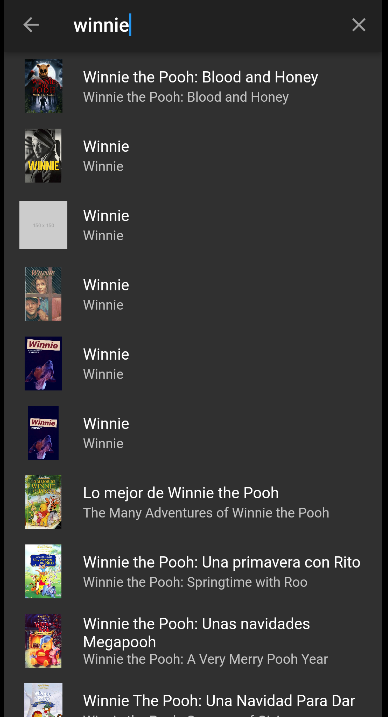

# Flutter_Movies
This is a movie app made using Flutter that allows users to view currently playing movies and the most popular movies. The app consumes data from the API provided by https://www.themoviedb.org/.

## Features
* View currently playing movies
* View the most popular movies
* View movie details such as ratings, release date, and synopsis
* Search for movies by title
## Installation
* Clone the repository: git clone https://github.com/juanchycc/Flutter_Movies
* Navigate to the project directory: cd proyect_folder
* Install dependencies: flutter pub get
* Run the app: flutter run
## API Key
To use this app, you will need to obtain an API key from https://www.themoviedb.org/. Once you have your API key, add it to the lib/providers/movies_provider.dart

## Screenshots

## License
This project is licensed under the MIT License - see the LICENSE file for details.